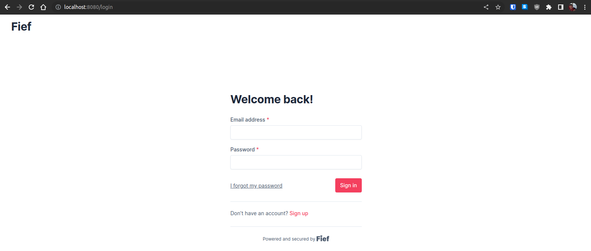
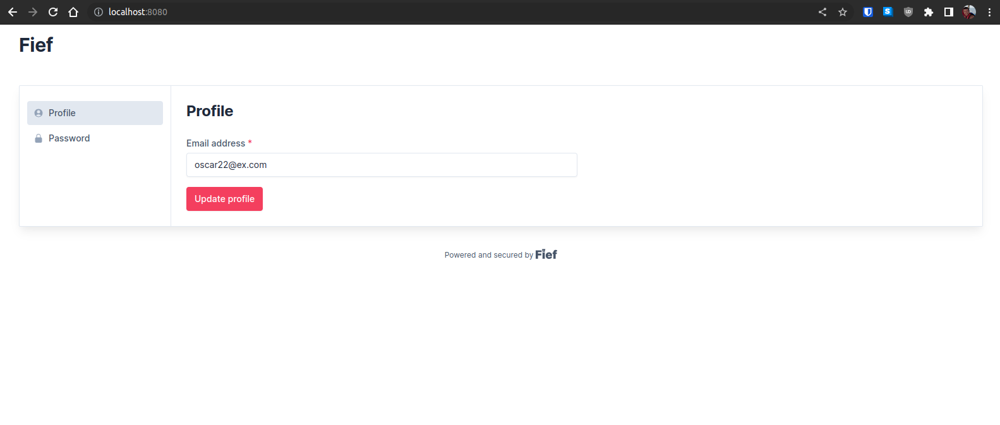
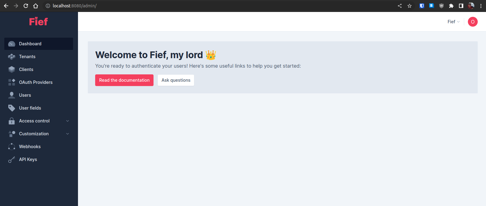
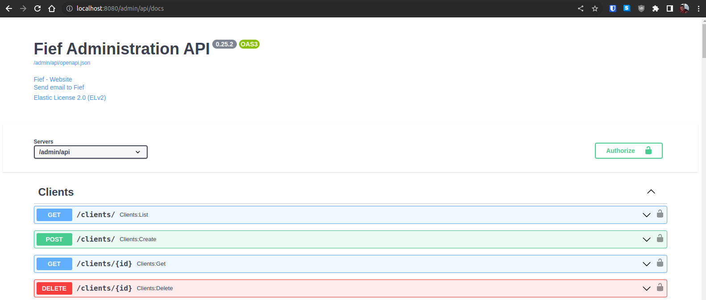
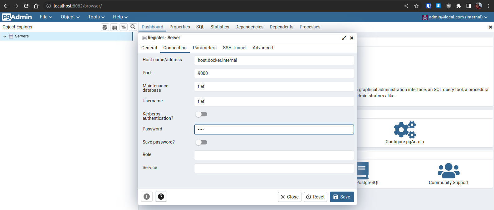
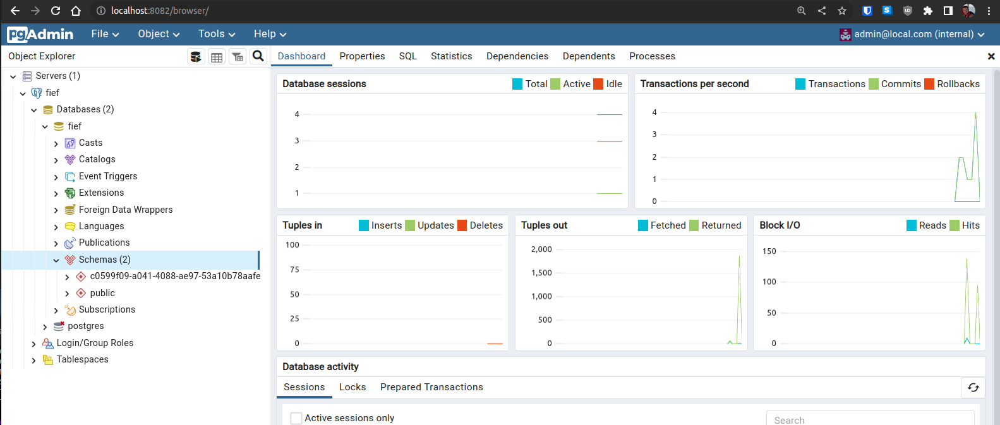

# K3D Fief Deploy

In addition to the [docker-compose](https://docs.fief.dev/self-hosting/deployment/docker-compose/#docker-compose) in the doc, this is a [k3d](https://k3d.io) ie. local kube deploy recipe.  
This is more cumbersome than the docker compose but closer to an actual deployment.

Tested on Ubuntu 22.04.

## Install

Required:

- [k3d](https://k3d.io)
- [kubectl](https://kubernetes.io/docs/tasks/tools/install-kubectl-linux/)
- [docker](https://www.digitalocean.com/community/tutorials/how-to-install-and-use-docker-on-ubuntu-22-04)

Optional:

- [k9s](https://k9scli.io/)

```sh
❯ k3d version
k3d version v5.5.1
k3s version v1.26.4-k3s1 (default)

❯ kubectl version --client --output=yaml
clientVersion:
  buildDate: "2023-05-17T14:14:46Z"
  compiler: gc
  gitCommit: 890a139214b4de1f01543d15003b5bda71aae9c7
  gitTreeState: clean
  gitVersion: v1.26.5
  goVersion: go1.19.9
  major: "1"
  minor: "26"
  platform: linux/amd64
kustomizeVersion: v4.5.7

❯ docker version
Client: Docker Engine - Community
 Version:           24.0.2
 API version:       1.43
 Go version:        go1.20.4
 Git commit:        cb74dfc
 Built:             Thu May 25 21:52:22 2023
 OS/Arch:           linux/amd64
 Context:           default

Server: Docker Engine - Community
 Engine:
  Version:          24.0.2
  API version:      1.43 (minimum version 1.12)
  Go version:       go1.20.4
  Git commit:       659604f
  Built:            Thu May 25 21:52:22 2023
  OS/Arch:          linux/amd64
  Experimental:     false
 containerd:
  Version:          1.6.21
  GitCommit:        3dce8eb055cbb6872793272b4f20ed16117344f8
 runc:
  Version:          1.1.7
  GitCommit:        v1.1.7-0-g860f061
 docker-init:
  Version:          0.19.0
  GitCommit:        de40ad0
```

## Imgages

Get images:

```sh
# k3d
docker pull rancher/k3s:v1.26.4-k3s1
docker pull ghcr.io/k3d-io/k3d-tools:5.5.1
docker pull ghcr.io/k3d-io/k3d-proxy:5.5.1

# fief
docker pull ghcr.io/fief-dev/fief:0.25.2
docker pull postgres:14.8-alpine
docker pull redis:7.0-alpine

# pgadmin
docker pull dpage/pgadmin4:2023-06-05-1
```

## Start

- Create cluster

```sh
k3d cluster create fief --config ./scripts/k3d-config.yml
```

- Create namespace

```sh
k3d cluster create fief --config k3d-config.yml
```

- Create secrets

```sh
kubectl -n fief create secret generic secret-pg --from-env-file=secrets/pg.env
kubectl -n fief create secret generic secret-fief --from-env-file=secrets/fief.env
```

- Aliases

```sh
alias _k='kubectl -n fief'
alias _k9s='k9s -n fief'
```

- Deploy

```sh
# persistant assets: pv, pvc
cd kustomize/persistent
_k apply -k .

# ephemeral assets: all the rest
cd kustomize/ephemeral
_k apply -k .


# check
_k9s
```


- Login as main user:



- Logged:



- Navigate to `/admin/` (ideally there would be a button):



- Check out swagger `/admin/api/docs//` (button too ?):



- Check out k3d containers:

```sh
❯ docker container list
CONTAINER ID   IMAGE                            COMMAND                  CREATED             STATUS             PORTS                                                                                                                                                                                              NAMES
4348aa4d727d   dpage/pgadmin4:2023-06-05-1      "/entrypoint.sh"         38 minutes ago      Up 38 minutes      443/tcp, 0.0.0.0:8082->80/tcp, :::8082->80/tcp                                                                                                                                                     pgadmin
ca01b727e5cf   ghcr.io/k3d-io/k3d-proxy:5.5.1   "/bin/sh -c nginx-pr…"   About an hour ago   Up About an hour   0.0.0.0:443->443/tcp, :::443->443/tcp, 0.0.0.0:8080->80/tcp, :::8080->80/tcp, 127.0.0.1:6445->6443/tcp, 0.0.0.0:9000->31000/tcp, :::9000->31000/tcp, 0.0.0.0:9001->31001/tcp, :::9001->31001/tcp   k3d-fief-serverlb
51c57ea544b2   rancher/k3s:v1.26.4-k3s1         "/bin/k3d-entrypoint…"   About an hour ago   Up About an hour                                                                                                                                                                                                      k3d-fief-agent-0
1f1aa25f1e60   rancher/k3s:v1.26.4-k3s1         "/bin/k3d-entrypoint…"   About an hour ago   Up About an hour                                                                                                                                                                                                      k3d-fief-server-0
```

- Check out postgres db with pgadmin:

```sh
docker run \
    --rm \
    --name pgadmin \
    -p 8082:80 \
    -e PGADMIN_DEFAULT_EMAIL=admin@local.com \
    -e PGADMIN_DEFAULT_PASSWORD=admin \
    -d \
    --add-host=host.docker.internal:host-gateway \
    dpage/pgadmin4:2023-06-05-1

```

- Log in:

  - BEWARE which host and port
    k3d is kube inside docker with a load balancer to access ingress and node ports. It is a bit of an Inception style exercice and easy to get lost...
  - IMPORTANT: Probably you need to allow port:

    ```sh
    # allow port
    sudo ufw allow 9000/tcp
    # status
    sudo ufw status numbered
    # remove
    sudo ufw delete 1 # twice
    ```



- Browser db:



- Connect to db with psql:

```sh
❯ psql -h localhost  -p 9000 -d fief -U fief -W
Password:
psql (14.8 (Ubuntu 14.8-0ubuntu0.22.04.1))
Type "help" for help.

fief=# \dt
               List of relations
 Schema |         Name         | Type  | Owner
--------+----------------------+-------+-------
 public | admin_api_key        | table | fief
 public | admin_session_tokens | table | fief
 public | alembic_version      | table | fief
 public | workspace_users      | table | fief
 public | workspaces           | table | fief
(5 rows)

fief=# \q
❯
```
